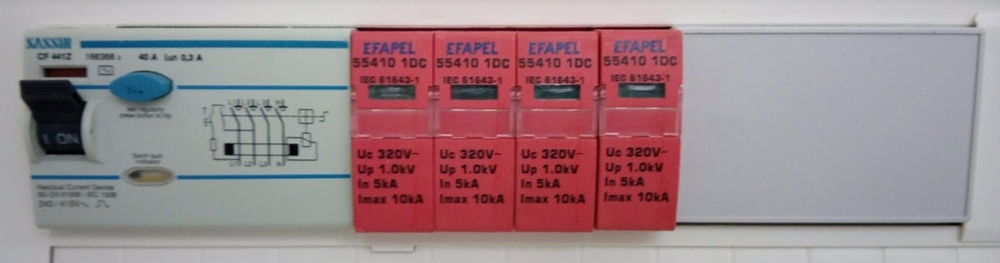

# eNode

access:
  site.login: true
  admin.login: true

**Table of Contents**   
1. [Intro](#id1)
2. [Hardware](#id2)
3. [Software](#id3)
4. [Measure Direction Hack](#id4)
5. [Build Examples](#id5)
   - [Single energy meter with energy direction](#id6)
   - [Three phase energy meter](#id7)
   - [Solar water heating monitor](#id8)
   - [Single phase three point energy meter + temperature sensors](#id9)
   - [Single energy meter with energy direction (Xtreme edition)](#id10)

## Intro 

**eNode** is a device based on ESP8266 and PZEM-004 that measures energy and/or temperature and delivers data to a MQTT broker and/or Emoncms. eNode is modular meaning you can start with a simple energy module a go up to a true 3-phase energy monitoring system, along with temperature detecton of up to 10 digital temperature sensors. Data is delivered through WiFi and configuration is done in it's own web page.

**Energy meter:**
  - Based on cheap Peacefair PZEM-004
  - Very accurate readings 
  - Energy direction possible with chip hack on first PZEM-004
  - up to 3 independent PZEM-004 per device
  - Volt, Ampere, RealPower

**Temperature meter:**
  - Based on cheap 1-wire DS18B20
  - up to 10 DSB20 digital 1-wire temperature sensors
  - Device addresses managed on the setup page

**Relay:**
  - MQTT controlled relay

**ESP8266**:
  - Easily configurable from web page
  - Delivers JSON formatted data to local/remote MQTT broker
  - Delivers data to local/remote Emoncms server
  - change refresh rate on demand

## Hardware 

Qty | Item | Function
:---: | :---: | ---:
1 | wemos D1 mini | `node`
1 | PSU 230VAC to 5VDC | `node`
1 | DC/DC 5V to 3.3VDC | `node`
3 | PZEM-004 | `Energy`
3 | R=510OHM | `Energy`
10 | DS18B20 | `Temperature`
1 |  R=4.7K OHM | `Temperature`
1| D1 relay shield|` Relay`

## Software 

- Load Arduino's `WebUpdater` example sketch to the ESP8266
- Upload the appropriate firmware located on the `/bin` folder to the ESP8266
- Access eNode at `SSID:APRENODE / PASSWORD:12345678` / `http://1.1.1.1`
- Configure `local WiFi settings`, `enode name` and reboot
- Navigate to `http://<eNode name>.local` or `http://<eNode IP address>`
- make sure all temperatures sensors are correctly mapped on the sensor positions
- make sure to indicate the correct number of energy sensors
- check direction if you have a hacked PZEM
- Configure `MQTT broker` and/or `Emoncms` account
- enjoy!

## Measure Direction Hack 

## Build examples 

### Single energy meter with energy direction 

### Three phase energy meter 

### Solar water heating monitor 

### Single phase three point energy meter + temperature sensors 

### Single energy meter with energy direction (Xtreme edition) 

Warning: this is a compact build with no isolation between the ESP8266 and the mains!

___

## Donate

Donate if you enjoy the firmware and would like to see this project develop.

