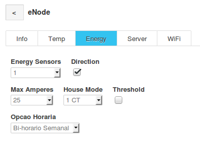

#EVSE Inteligente

### Índice

1. [Características](#id1)
2. [Configurações](#id2)
	- [Configuração inicial](#id20)
	- [Página inicial](#id21)
	- [Temporizadores Básicos](#id22)
	- [Temporizadores Avançados](#id23)
	- [Estatísticas](#id24)
	- [Configuração INFO](#id25)
	- [Configuração SCENE](#id26)
	- [Configuração CAR](#id27)
	- [Configuração SRV](#id28)
	- [Configuração WIFI](#id29)
3. [Carregar](#id3)
4. [Botão e LED](#id4)
5. [Medidor de energia](#id5)
	- [Instalação](#id51)
	- [Configuração](#id52)

===

## <a href="#topo">1. Características</a> 

#### Hardware
- **OpenEVSE** v4 customizado
- Contactor 2P **63A**
- Ficha **CEE 32A** monofásica
- Sensor de **temperatura**
- Sensor de **energia**
- LED RGB 
- Botão capacitivo
- Comunicação WiFi

#### Funcionalidades
- Funciona como Access Point WiFi e/ou liga-se a um  AP existente  
- Regula os amperes através da pagina web
- Liga/desliga a carga através da página web
- temporizador básico (atraso, duração e cargas percentuais)
- temporizador avançado (hora inicio, hora fim, SOC inicial, SOC final)
- Cenas ( programa cargas exclusivamente em bi-horário ou em períodos definidos pelo utilizador)
- Guarda os dados das sessões de carga
- Envia dados instantâneos de carga para servidor Emoncms
- Ajusta automaticamente o consumo do carro à casa
- Permite carregar apenas com excedente solar

## <a href="#topo">2. Configurações</a> 

#### <a href="#topo">Configuração inicial</a> 

Quando e EVSE é ligado à tomada pela primeira vez, ou quando é executado um "factory defaults" as credenciais de acesso revertem para os valores originais:

> - SSID: APEVSE
> - Password: 12345678

Quando um dispositivo se liga ao EVSE por WiFi recebe um endereço IP através de DHCP. Abrir um navegador de Internet e navegar para o seguinte endereço `http://10.1.1.1`

##### Factory Defaults

- Ligar o EVSE à tomada e observar o LED.
- Quando o LED passar a azul premir o botão capacitivo
- manter premido o botão durante aproximadamente 5 segundos
- O EVSE irá apagar as configurações e arranca com as definições originais. 

#### <a href="#topo">Página inicial</a> 

- (1) Acesso às configurações
- (2) Páginas das estatísticas de cargas
- (3) Barra de status: 
	- `AP - Modo WiFi Access Point` 
	- `STA - Ligado a um Access Point`
	- `DEL - Temporização de delay` tocar para desativar
	- `DUR - Temporização de duração` tocar para desativar
	- `CH - Temporização de constrangimento de carga` tocar para desativar
- (4) Comunicação com o OpenEVSE - tocar para saber se o carro está ligado
- (5) Estado do EVSE, apresenta informações variadas
- (6) Em carga apresenta o tempo decorrido, caso contrário apresenta a tensão da rede
- (7) Permite mudar os cenários
	- `MASTER` - Cenário manual (função OFF)
	- `Auto Bi-Horário` - Liga o EVSE apenas em período VAZIO
	- `Auto Scene` - Liga o EVSE apenas durante os períodos definidos pelo utilizador
- (8) Desabilita ou Habilita o EVSE
- (9) Seleção dos amperes do EVSE
- (10) Seleção de Modos de carga do EVSE
	- `MANUAL` - Não altera amperes automaticamente
	- `NORMAL` - Carrega dinamicamente até ao valor máximo definido em (9)
	- `POWER` - Carrega o máximo que o consumo global da casa permite
	- `SOLAR` - Carrega energia solar, mantendo um mínimo de 6A
- (11) Abre menu de temporização, explicado em mais detalhe na secção própria

#### <a href="#topo">Temporizadores Básicos</a> 

Pressionar em `Timers` repetidamente até aparecer a secção desejada: `TIMERS` -> `STD TIMERS`

No modo `STD TIMERS` é possível definir os seguintes parâmetros:
- `DELAY`: Define um valor de atraso. Assim que é configurado o EVSE passa a **desabilitado** e aparece no canto superior esquerdo a indicação `DEL`. Ao pressionar em `DEL` é desconfigurado o atraso. Nesta situação de desconfiguração o EVSE permanece no estado em que se encontra. Este temporizador arranca imediatamente após ter sido configurado, independentemente de haver um veiculo ligado.
- `DURATION`: Define uma duração de carregamento. Assim que é configurado aparece no canto superior esquerdo a indicação `DUR`. Ao pressionar em `DUR` é desconfigurada a duração. 
- `LIMIT`: Define um limite de energia durante  a sessão de carregamento. Se o limite for definido em `kWh`, o valor inserido é referente à energia que é contabilizada da tomada. Nas outras situações, `%` ou `Km` o valor passa a ser uma estimativa da energia liquida que é calculada a partir dos dados inseridos nas [configurações do veículo](#id27).

Os temporizadores `DURATION` e `LIMIT` podem funcionar em simultâneo. São ativados somente quando uma carga é iniciada. Quando um dos temporizadores chega ao fim a carga é terminada e os temporizadores são desconfigurados.

No caso de os temporizadores estarem ativados, aparece no écran a próxima ação do EVSE. No exemplo da figura acima a próxima ação é a de habilitar o EVSE assim que terminar o atraso configurado. Nessa altura o EVSE é habilitado e a carga é iniciada e aparece o tempo e a quantidade de kWh até que a carga termine.

#### <a href="#topo">Temporizadores Avançados</a> 

Pressionar em `Timers` repetidamente até aparecer a secção desejada: `TIMERS` -> `STD TIMERS` -> `ADV TIMERS`

> `ADV TIMERS`: Apenas está disponível quando o EVSE consegue comunicar com um servidor **NTP**. Esta funcionalidade usa o mesmo conceito dos temporizadores básicos, qualquer parametrização efetuada será traduzida numa combinação de valores `DELAY`, `DURATION`, `LIMIT`

Há várias combinações possíveis, algumas poderão resultar em configurações inválidas:

- `Start SOC` - Valor de % de bateria que o veiculo possui antes de iniciar a carga
- `End SOC` - Valor de % de carga desejado
- `Start Time` - Hora pretendida para inicio da carga
- `End Time` - Hora pretendida para fim de carga

Definir um `End SOC` **sem** um `Start SOC` é ambíguo e não é considerado. Definir apenas um `Start SOC` assume automaticamente um `End SOC` de 100%.

No caso de ser definido um `Start Time`, é calculado e aplicado automaticamente um `DELAY`. Adicionalmente se existir um `End Time` é configurado um `DURATION` que é a diferença entre o fim da carga e o inicio. Pode ser também definido um par de valores `Start SOC` e `End SOC` válido que resulta na respetiva aplicação em `%` de um `LIMIT`. Há configurações que podem provocar efeitos indesejados, como por exemplo carregar dos 10% de SOC aos 100% de SOC em 5 minutos. Neste caso o efeito da configuração resulta no EVSE ligado durante 5 minutos apenas.

Se for definido apenas um `End Time` é calculado um `DURATION` que consiste no tempo desejado menos o tempo presente. Esta situação apenas produz resultados previsíveis se o veiculo já estiver em carga, uma vez que o valor `DURATION` apenas está ativo durante uma sessão de carga.

Ao definir um `End Time` e um um par de valores `Start SOC` e `End SOC` válido, o temporizador irá calcular o tempo necessário para carregar o veiculo, tendo em conta o valor de `AMPERES` configurado na página principal. Com esse valor é possível estimar a hora de inicio, e configurar um `DELAY`, `DURATION` e `LIMIT` automaticamente.

#### <a href="#topo">Estatísticas</a> 

Cada carga é registada na memoria do EVSE. São registados os seguintes valores:
- `Data` de inicio da carga. no caso de o EVSE não estar ligado à Internet aparece "No NTP"
- `Duração` da sessão de carga
- `kWh` consumidos da tomada
- `Potencia` média de carga

No topo da página aparecem contadores acumulados de tempo e energia consumida.

No fundo da página aparece a opção de salvar o ficheiro que contém o registo das cargas ou uma opção para entrar no sistema de ficheiros do EVSE para poder editar ou repor o ficheiro.

> O ficheiro das cargas do EVSE é chamado de `chf.txt`, e é um ficheiro com os valores separados por virgulas.
> É possível editar cargas, adicionar ou apagar entradas de forma a manter um registo coerente do numero de cargas de um determinado veiculo elétrico.

#### <a href="#topo">Configuração INFO</a> 
#### <a href="#topo">Configuração SCENE</a> 

Esta página permite configurar até 2 temporizadores independentes dentro dos quais o EVSE fica habilitado a carregar. Fora destes horários o EVSE permanece desabilitado. A ativação desta funcionalidade é feita na pagina principal selecionando a cena `Auto Scene`.

A opção horária contratada da instalação é definida em `Opção Horária` e é usada na cena `Auto Bi-Horário`.

#### <a href="#topo">Configuração CAR</a> 

Estão pré-configurados alguns valores típicos de capacidade útil de alguns veículos elétricos que podem ser selecionados da lista no topo da página.

- `Pack size` - Capacidade útil do pack de baterias
- `Degradation` -  Degradação estimada da bateria
- `SOC adjustments` - Ajuste entre o SOC apresentado no quadrante do carro e o SOC real. `SOC_m` e `SOC_b` são os parâmetros da equação da reta que os relacionam e são obtidas por método empírico. No caso de não haver relação, `SOC_m = 1` e `SOC_b = 0`
- `Charger efficiency` - eficiência de carga do carregador interno do veiculo nos intervalos indicados.
- `Average Consumption` - Consumo médio do carro, usado para poder programar cargas com base em **Km**.

Quanto mais **reais** forem estes valores, mais aproximado é o resultado dos [temporizadores avançados](#id23)

Existem mais 2 parâmetros que podem ser configurados nesta página:

- `Maximum EVSE Amps` - Este valor define os amperes máximos permitidos pelo EVSE em segurança. Deve refletir o valor máximo permitido pelo próprio EVSE ou, o valor máximo que a tomada do posto de carregamento permite, no caso de este valor ser inferior ao do próprio EVSE.

- `Autostart Hold Timer` - Valor de espera para resumir a carga quando o EVSE desliga o carro temporariamente por excesso de potência consumida. Múltiplo de 5 segundos. Valor mínimo recomendado: 5 (25 segundos)

#### <a href="#topo">Configuração SRV</a> 

##### <a href="#topo">Emoncms</a> 
- `Emoncms Host` - Endereço IP ou nome do site que aloja o servidor Emoncms.
- `Emoncms URL` - Caminho no URL. Se o Emoncms estiver instalado na raiz não se preenche.`
- `Emoncms API Key` - chave **write** API que pode ser encontrada na aplicação Emoncms

Exemplo de um servidor instalado localmente em `http://192.168.0.1/emoncms`
- `Emoncms Host = 192.168.0.1`
- `Emoncms URL = Emoncms`

O nome do `node` no Emoncms é derivado do **Nome do EVSE** definido na secção [Configuração WIFI](#id29)

 
##### <a href="#topo">MQTT</a> 
- `MQTT Server` - Endereço IP ou nome do site que aloja o Broker MQTT.
- `MQTT Base` - Prefixo do tópico que o EVSE publica e subscreve

Exemplo:
- `MQTT Server = 192.168.20.1`
- `MQTT Base = "evse"`
- `Name = "garagem"`  (definido na secção [Configuração WIFI](#id29))

O EVSE subscreve o tópico `evse/garagem/to` e publica dados em `evse/garagem/from`. Adicionalmente regista uma mensagem de `LastWill` em `client/garagem` publica nesse tópico uma mensagem persistente com o IP do EVSE.

##### <a href="#topo">eNode</a> 

- `eNode Host` - - Endereço IP do eNode. Pode ser um FQDN
- `eNode Port` - deverá ser sempre 8888

#### <a href="#topo">Configuração WIFI</a> 

Parâmetros configuráveis:

- `Name` - Nome do EVSE, é usado na pagina principal do EVSE, no [`Emoncms`](#id281) e no [`MQTT`](#id282) 
- `WiFi Access Point` - Credenciais de acesso em modo Access Point.
- `WiFi STA1` - Credenciais de acesso a um Access Point existente. E possível definir um IP fixo. o link `(preconfigure)` preenche automaticamente os valores atuais.
- `WiFi STA2` - Credenciais de acesso a um segundo Access Point existente. O EVSE apenas se liga a este SSID se não estiver presente a primeira rede.
- `SAVE` - guarda as configurações
- `SCAN WIFI NETWORKS` - procura redes WiFi. ao clicar na rede WiFi é preenchido automaticamente o `SSID` do `WiFi STA1`.

## 3. <a href="#topo">Carregar</a> 

Quando o EVSE está a carregar, aparecem linhas adicionais com as seguintes estatísticas:

- O valor da tensão da rede passa a apresentar o tempo decorrido
- Na 1ª linha abaixo do tempo decorrido são mostradas medidas instantâneas de energia seguido da energia consumida da tomada
- Na linha seguinte é mostrado a % de carga, o numero de Km carregados e a temperatura do EVSE

Quando existe um **medidor de energia** eNode na instalação ligado à mesma rede que o EVSE e se estiver definido nas [configurações](#id283) o EVSE estabelece comunicação com o medidor de energia. Se a ultima mensagem recebida do medidor de energia tiver sido recebida há menos de 10 segundos, o Seletor de Modos de carga do EVSE passa a verde. Caso contrário fica vermelho.

## <a href="#topo">4. Botão e LED</a> 

O Botão capacitivo pode executar diferentes funções consoante o estado do EVSE. Atualmente está desligado por software.

- Sem estar a carregar
	- **toque curto** - muda entre 3 valores de amperes predefinidos
	- **toque longo** - Reverte o EVSE para **habilitado** e em modo `NORMAL`
- Durante carregamento	
	- **toque curto** - sem função
	- **toque longo** - sem função

	
O LED RGB fornece uma indicação visual do estado do EVSE:

- `VERDE constante` - EVSE **pronto a funcionar**, sem veiculo ligado
- `VERDE piscar` - EVSE **ligado ao veiculo** sem carregar ( veiculo com temporizador ou com 100% de carga)
- `AZUL constante` - EVSE **em carga**
- `ROXO` - EVSE **desabilitado**
- `VERMELHO constante` - **ERRO** do EVSE
- `VERDE constante a piscar AMARELO` - EVSE **pronto** Modo SOLAR
- `VERDE constante a piscar LARANJA` - EVSE **pronto** Modo POWER
- `VERDE constante a piscar AZUL` - EVSE **pronto** Modo NORMAL
- `ROXO constante a piscar AMARELO` - EVSE **desabilitado** Modo SOLAR
- `ROXO constante a piscar LARANJA` - EVSE **desabilitado** Modo POWER
- `ROXO constante a piscar AZUL` - EVSE **desabilitado** Modo NORMAL
- `AZUL constante a piscar AMARELO` - EVSE **em carga** Modo SOLAR em funcionamento
- `AZUL constante a piscar LARANJA` - EVSE **em carga** Modo POWER em funcionamento
- `AZUL constante a piscar VERMELHO` - EVSE **em carga**, FALHA de comunicação com o medidor de energia

## <a href="#topo">5. Medidor de energia</a> 

#### <a href="#topo">Instalação</a> 

Antes de fazer qualquer alteração no quadro elétrico é obrigatório desligar o disjuntor geral do fornecimento de energia.

- (1) - Encontrar um local apropriado dentro do quadro elétrico para **instalar o eNode**
- (2) - Localizar o barramento do **Neutro** e ligar o **fio azul** de secção máxima 1.5mm²
- (3) - Localizar um disjuntor de 10A pouco relevante (iluminação p/ex) e ligar o **fio preto** de secção 1,5mm². É importante o fio existente e o fio do eNode terem a **mesma secção** para serem sujeitos ao mesmo aperto no respetivo disjuntor.
- (4) - Colocar o sensor de corrente (CT) num dos fios que alimentam o quadro elétrico, na fase ou no neutro.
- Uma vez que o eNode mede direção de corrente, no primeiro ensaio se houver consumo negativo é necessário **inverter o CT**. Pode ser trocado o sentido do CT ou podem ser trocados os fios vermelho e preto entre eles no próprio medidor. Importante efetuar estas alteração sempre com o **quadro desligado**.

#### <a href="#topo">Configuração</a> 

Quando o eNode é ligado à tomada, radia o seu SSID para poder ser acedido.

> - SSID: APRENODE
> - Password: 12345678

Aceder ao WiFi do eNode, e navegar para o endereço `http://10.1.1.1`

No caso de as leituras de energia estarem trocadas é necessário **desligar o quadro elétrico**, e **trocar o CT de orientação**. Quando estiver OK clicar no botão do menu, `≡`, no canto superior esquerdo.

Navegar para a secção WiFi e configurar a rede WiFi local:

- `Name` - Nome do eNode, é usado na pagina principal do EVSE, no `Emoncms` e no `MQTT` 
- `WiFi Access Point` - Credenciais de acesso em modo Access Point.
- `WiFi STA1` - Credenciais de acesso a um Access Point existente. E possível definir um IP fixo. o link `(preconfigure)` preenche automaticamente os valores atuais.
- `SCAN WIFI NETWORKS` - procura redes WiFi. ao clicar na rede WiFi é preenchido automaticamente o `SSID` do `WiFi STA1`.

Após efetuar a configuração reiniciar o eNode, `INFO` -> `REBOOT`. Esperar um pouco e aceder ao eNode da mesma forma, navegar até à página `≡` -> `INFO`. Se o eNode conseguir ligar à rede WiFi anotar o endereço  IP que aparece na secção `NETWORK`. Caso o eNode esteja ligado a uma rede WiFi externa, apenas radia o seu SSID interno durante os primeiros 5 minutos.

Assim já é possível aceder ao eNode através da rede local através do endereço IP anotado no passo anterior.

É ainda necessário efetuar as seguintes configurações:

- `Energy Sensors` - Numero de PZEMs presente no eNode. `Default:1`
- `Direction` - Deteção de sentido de corrente. `Default:sim`
- `Max Amperes` - Amperes contratados ao fornecedor de energia
- `House Mode` - Modo `1CT` assume 1 sensor de corrente no fornecimento geral da instalação. O modo `2CT` assum um eNode com 2 PZEMs onde o primeiro está ligado ao **consumo** e o segundo está ligado à **produção solar**. `Default:1CT`
- `threshold` - envia alertas por MQTT se detetado consumo excessivo

